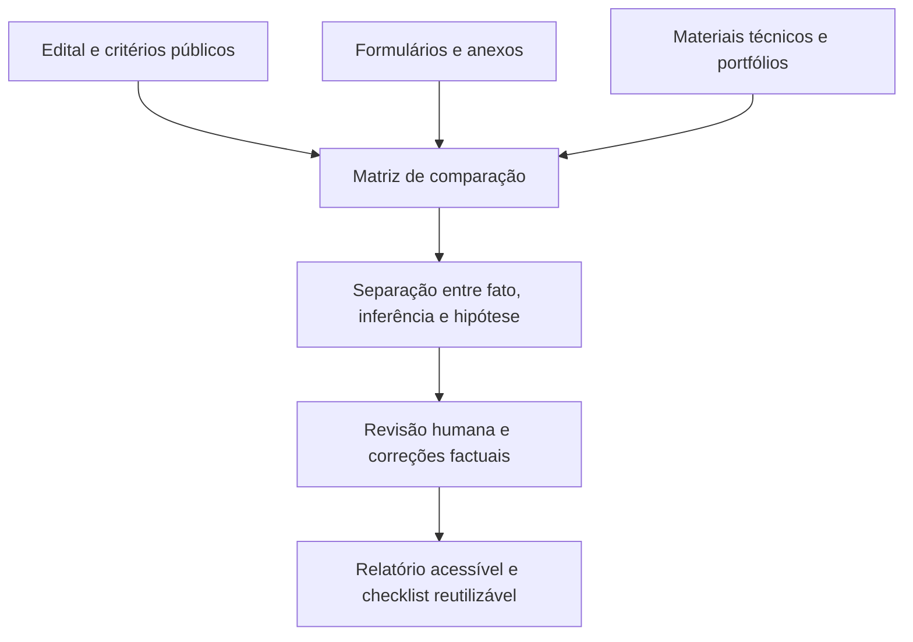

# Análise documental assistida por LLM para editais culturais

**Autor:** Ramon Luz  
**Contexto institucional:** trabalho realizado no âmbito da LIMEBH  
**Nome previsto do repositório:** `analise-documental-llm-editais-culturais`

## Resumo

Este case registra um fluxo de análise documental qualitativa realizado no contexto da LIMEBH e da Virada Cultural de Belo Horizonte 2026. O trabalho transformou edital, inscrições, materiais técnicos e informações complementares em uma comparação rastreável entre três propostas anonimizadas.

A tese do case é simples: uma LLM pode apoiar a leitura e a organização de documentos heterogêneos, desde que as conclusões permaneçam ancoradas em evidências, critérios públicos e revisão humana.

> Este não é um sistema de seleção, previsão ou classificação automática. É um processo de análise qualitativa assistida por LLM, com limites explícitos.

## Contexto

A LIMEBH precisava compreender desfechos distintos de três inscrições em um chamamento da Virada Cultural de Belo Horizonte 2026. Não havia acesso a notas individuais, pareceres ou debates da comissão.

O objetivo foi produzir aprendizado prático para futuras inscrições, sem atribuir causas que os documentos não permitiam demonstrar.

## Problema

Os materiais estavam distribuídos entre edital, formulários, portfólios, riders, mapas de palco, imagens, vídeos e documentação. A pergunta não era “por que alguém foi aprovado?”, mas:

- quais requisitos e critérios públicos eram observáveis;
- quais fatores de compatibilidade eram plausíveis;
- quais riscos documentais e operacionais podiam ser identificados;
- como transformar a experiência em um protocolo melhor para próximos editais.

## Abordagem

O processo combinou leitura documental, extração assistida por LLM, comparação orientada pelo edital e revisão humana. A LLM foi usada para organizar contexto, sintetizar evidências, comparar campos e redigir o relatório; ela não atribuiu notas nem tomou decisões.

O trabalho é de Ramon Luz, realizado no âmbito da LIMEBH. A LLM foi utilizada exclusivamente como ferramenta de apoio à leitura, estruturação, comparação e redação; não é apresentada como autora ou coautora.

## Papel da LLM

- Apoiar a leitura de documentos extensos e de formatos distintos.
- Estruturar dados qualitativos em dimensões comparáveis.
- Relacionar evidências observáveis aos critérios públicos do chamamento.
- Ajudar a distinguir fatos, inferências e hipóteses.
- Produzir uma comunicação clara para pessoas técnicas e não técnicas.

Não houve RAG, embeddings, banco vetorial, classificador, algoritmo preditivo ou pipeline automatizado de decisão.

## Competências demonstradas

- Processamento e síntese de documentos heterogêneos.
- Organização de contexto para análise assistida por LLM.
- Comparação qualitativa orientada por critérios públicos.
- Rastreabilidade de evidências e controle de incerteza.
- Revisão humana, correções factuais e comunicação responsável.
- Privacidade, anonimização e governança de materiais sensíveis.

## Principais aprendizados

1. Viabilidade operacional pode ser tão relevante quanto qualidade artística em eventos de programação contínua.
2. Pré-seleção e contratação são etapas diferentes; propostas podem ser adaptadas posteriormente.
3. Clareza, organização e navegabilidade dos materiais fazem parte da qualidade de uma inscrição.
4. Documentação exige uma checagem própria, independente da qualidade artística.
5. A análise ganha credibilidade quando separa evidência, inferência e hipótese.

## Limitações

- Não houve acesso a notas, pareceres ou justificativas individuais da comissão.
- As conclusões são qualitativas e não explicam oficialmente os resultados da seleção.
- A análise não prevê aprovação em editais futuros.
- A experiência de navegação da comissão nos links originais não pôde ser reproduzida historicamente.

## Anonimização

Os três casos são apresentados como **Coletivo A**, **Coletivo B** e **Coletivo C**. Foram removidos nomes, links, horários, palcos, detalhes contratuais, documentos pessoais, materiais de terceiros, riders originais e trechos literais de formulários.

A anonimização é tratada como prevenção de reidentificação, não apenas substituição de nomes. Veja a [política de anonimização](anonymization-policy.md).

## Referências públicas

As referências abaixo contextualizam o evento e o processo público. Elas não substituem o edital analisado nem oferecem justificativas individuais de seleção.

- [Virada Cultural de Belo Horizonte 2026 — página institucional](https://prefeitura.pbh.gov.br/fundacao-municipal-de-cultura/festivais/viradacultural)
- [Inscrições para a Virada Cultural de Belo Horizonte 2026 — Prefeitura de Belo Horizonte](https://prefeitura.pbh.gov.br/noticias/ultimos-dias-para-artistas-e-servidores-publicos-se-inscreverem-na-virada-cultural-de-belo)
- [Avaliação das propostas inscritas — Prefeitura de Belo Horizonte](https://prefeitura.pbh.gov.br/noticias/virada-cultural-de-bh-inicia-avaliacao-das-mais-de-900-propostas-inscritas)

## Documentos do case

- [Estudo de caso](case-study.md)
- [Metodologia efetivamente utilizada](methodology.md)
- [Matriz pública de evidências](evidence-matrix.md)
- [Política de anonimização](anonymization-policy.md)
- [Checklist reutilizável para inscrições culturais](checklist.md)

## Licença

O conteúdo documental deste repositório está licenciado sob [Creative Commons Attribution 4.0 International — CC BY 4.0](LICENSE). A licença não se aplica a marcas, documentos de origem, obras de terceiros ou materiais excluídos deste case.

## Projeto de portfólio

Este é um case de portfólio final em português sobre análise documental qualitativa assistida por LLM. Ele preserva as limitações metodológicas, a anonimização dos casos e a exclusão de documentos de origem, dados pessoais, links de inscrição e materiais protegidos de terceiros.
